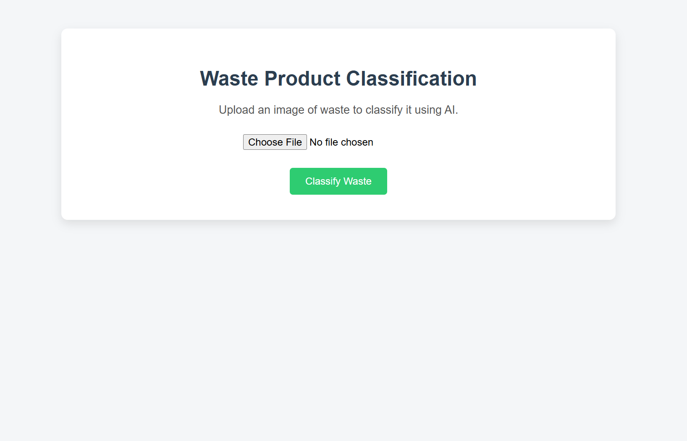
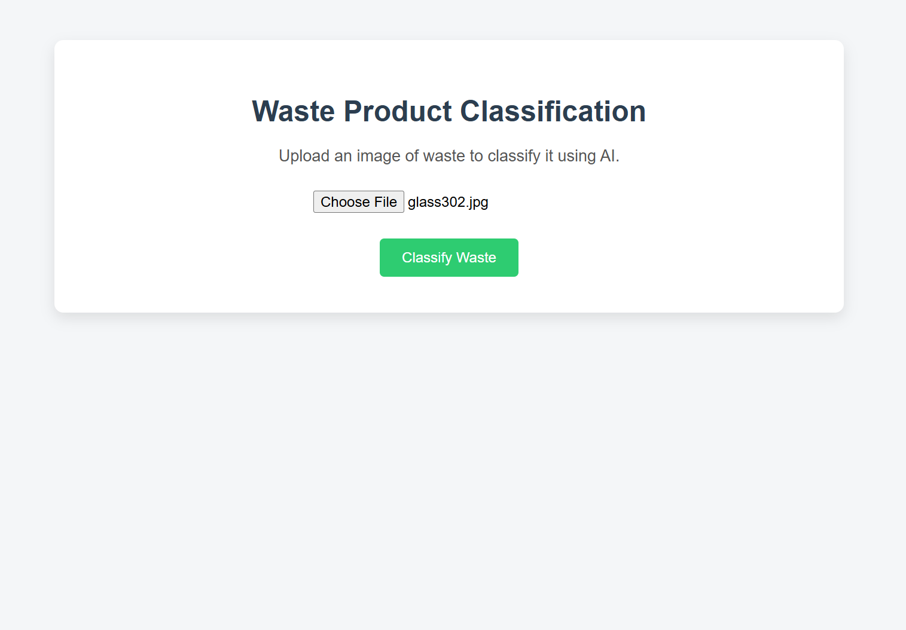
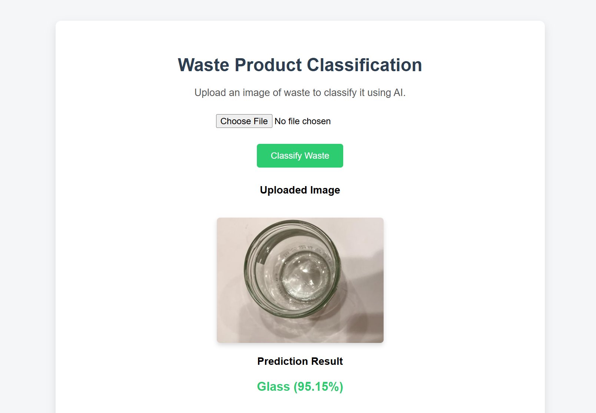

# ♻️ Waste Product Classification  
### Transfer Learning & Fine-Tuning | Flask Deployment


---

## 📌 Project Summary (ATS-Optimized)

An **end-to-end computer vision and deep learning project** that classifies waste images into multiple categories using **transfer learning and fine-tuning of a pre-trained CNN (VGG16)**.  
The trained model is deployed using a **Flask web application** that supports **real-time image upload, preprocessing, prediction, and confidence scoring**, enabling **automation in waste management and sustainability systems**.

---

## 🚀 Key Skills Demonstrated (ATS Keywords)

- Computer Vision  
- Deep Learning  
- Transfer Learning  
- Convolutional Neural Networks (CNN)  
- TensorFlow / Keras  
- Flask Deployment  
- Image Classification  
- Model Fine-Tuning  
- Data Augmentation  
- Model Inference Pipeline  
- Sustainable AI Applications  

---

## 🧠 Project Features

- Transfer learning using **VGG16 pretrained on ImageNet**
- CNN fine-tuning for domain-specific waste classification
- Automated dataset splitting (train / validation / test)
- Image preprocessing pipeline (resize, normalization, batching)
- Real-time inference via Flask web application
- Prediction confidence score output
- Modular, production-ready project structure

---

## 🗂️ Waste Categories

The model classifies waste images into the following categories:

- Cardboard  
- Glass  
- Metal  
- Paper  
- Plastic  
- Trash  

---

## 🛠️ Technology Stack

| Category | Tools |
|------|------|
| Programming Language | Python |
| Deep Learning Framework | TensorFlow / Keras |
| CNN Architecture | VGG16 (Transfer Learning) |
| Backend Framework | Flask |
| Frontend | HTML, CSS |
| Image Processing | OpenCV, Pillow |
| Dataset | TrashNet (Garbage Classification) |

---

## 📁 Project Structure

```text
waste_product_classification/
│
├── app.py
├── requirements.txt
├── README.md
│
├── models/
│   ├── model.h5
│   └── labels.txt
│
├── data/
│   ├── train/
│   ├── val/
│   └── test/
│
├── raw_dataset/
│
├── static/
│   ├── css/
│   │   └── style.css
│   └── uploads/
│
├── templates/
│   └── index.html
│
├── utils/
│   ├── preprocess.py
│   └── model_loader.py
│
├── notebooks/
│   └── training.ipynb
│
└── split_dataset.py
```

---

## ⚙️ Workflow Overview

1. User uploads a waste image through the web interface  
2. Image preprocessing (resizing, normalization, batching)  
3. CNN model performs inference  
4. Predicted waste class and confidence score are displayed  

---

## 📊 Model Training Details

- Pre-trained VGG16 model initialized with ImageNet weights  
- Custom dense classification head added  
- Data augmentation to improve generalization  
- Fine-tuning of upper convolutional layers  
- Adam optimizer with categorical cross-entropy loss  

---

## 📸 Application Screenshots 

### Home Page & Upload Interface


### Image Preview


### Prediction Output



---

## ▶️ How to Run

```bash
git clone <your-repo-url>
cd waste_product_classification
python -m venv venv
venv\Scripts\activate
pip install -r requirements.txt
python app.py
```

Access the application at:
```
http://127.0.0.1:5000/
```

---

## 🌍 Real-World Use Cases

- Smart waste segregation systems  
- Recycling and sustainability automation  
- AI-powered environmental monitoring  
- Intelligent waste management pipelines  

---

## 📌 Resume-Ready Highlights

- Built an end-to-end waste classification system using deep learning and computer vision  
- Applied transfer learning and fine-tuning on real-world waste image datasets  
- Deployed a CNN model using Flask for real-time image inference  
- Designed a modular and production-ready ML deployment pipeline  

---

## 📄 License

This project is intended for **educational and portfolio purposes**.
